# CLI reference

**Binary:** `llm-stream-guard` (also `npx llm-stream-guard`)  
**Entry:** `dist/cli.js` after build  
**Version:** 0.8.2+

For conceptual background see [Getting started](./getting-started.md) and [Policy reference](./policy-reference.md).

---

## Global environment

| Variable            | Applies to                            | Effect                                              |
| ------------------- | ------------------------------------- | --------------------------------------------------- |
| `GUARD_MODE`        | `scan`, policy load                   | Override policy `mode` (`block` / `warn` / `audit`) |
| `GUARD_POLICY_PATH` | `scan`, `audit drift`, `audit static` | Default `--policy` when flag omitted                |

Invalid `GUARD_MODE` values are ignored (policy/default wins).

---

## Commands overview

```text
llm-stream-guard validate <policy>
llm-stream-guard resolve <policy> [--json]
llm-stream-guard scan --policy <p> [--mode M] [--stdin-format F] [--json] <paths...|->
llm-stream-guard diff <policyA> <policyB> [--check] [--json]
llm-stream-guard profiles list
llm-stream-guard profiles show <id>
llm-stream-guard audit validate-manifest --manifest <path> [--json]
llm-stream-guard audit drift --policy <p> --manifest <m> [--json]
llm-stream-guard audit static [options]
```

---

## `validate`

Check policy schema without running a scan.

```bash
npx llm-stream-guard validate policies/agent-gate.json
echo $?   # 0 = valid, 1 = validation errors printed
```

Errors print as `POLICY_E00x path message` lines.

---

## `resolve`

Expand `extends` and print merged effective policy.

```bash
npx llm-stream-guard resolve policies/examples/extends-agent.json
npx llm-stream-guard resolve policies/examples/extends-agent.json --json
```

---

## `scan`

Scan **event JSON**, **JSONL**, **SSE/text bytes**, or **stdin** using compiled policy rules.

```bash
# JSON event file
npx llm-stream-guard scan --policy policies/agent-gate.json test/fixtures/events/clean-tool.json

# Directory walk
npx llm-stream-guard scan --policy policies/agent-gate.json test/fixtures/events/

# Stdin pipe
cat capture.jsonl | npx llm-stream-guard scan --policy policies/agent-gate.json -

# Machine-readable report
npx llm-stream-guard scan --policy policies/agent-gate.json --json file.json

# Force SSE byte interpretation on .txt
npx llm-stream-guard scan --policy policies/proxy-strict.json --stdin-format sse stream.txt
```

### Format detection (by extension + content)

| Input                             | Behavior                         |
| --------------------------------- | -------------------------------- |
| `.json` array or `{ events: [] }` | Event scan                       |
| `.jsonl`                          | One event per line               |
| `.json` non-event text            | Byte scan                        |
| `.sse` / SSE stdin                | Byte scan with SSE normalization |
| Binary (NUL in first 512 B)       | Skipped                          |

### Exit codes (CLI)

| Code | Meaning                                 |
| ---- | --------------------------------------- |
| 0    | No violations                           |
| 1    | Violations found                        |
| 2    | Usage error (missing policy, bad flags) |

---

## `diff`

Compare two **resolved** policies.

```bash
npx llm-stream-guard diff policies/v1.json policies/v2.json
npx llm-stream-guard diff policies/a.json policies/b.json --check   # CI gate
npx llm-stream-guard diff policies/a.json policies/b.json --json
```

`--check` exits 1 when differences exist (used by GitHub Action baseline gate).

---

## `profiles`

Shipped policy templates (same files as `policies/`).

```bash
npx llm-stream-guard profiles list
npx llm-stream-guard profiles show agent-gate
```

---

## `audit validate-manifest`

Schema-check a tools manifest (version, non-empty tool names).

```bash
npx llm-stream-guard audit validate-manifest --manifest tools/manifest.json
npx llm-stream-guard audit validate-manifest tools/manifest.json --json
```

---

## `audit drift`

Compare manifest tool **names** vs policy allow/deny lists only.

```bash
npx llm-stream-guard audit drift \
  --policy policies/agent-gate.json \
  --manifest tools/manifest.json
```

---

## `audit static`

Full offline audit: drift + dangerous patterns (D001–D006) + `blockToolArgs` static preview.

```bash
npx llm-stream-guard audit static \
  --policy policies/agent-gate.json \
  --root . \
  --manifest tools/manifest.json

# Multi-policy directory
npx llm-stream-guard audit static --policy-dir policies/ --root . --manifest tools/manifest.json

# SARIF preview
npx llm-stream-guard audit static \
  --policy policies/agent-gate.json \
  --root . \
  --manifest tools/manifest.json \
  --sarif-out /tmp/guard.sarif

# Strict mode (drift warnings → errors)
npx llm-stream-guard audit static --strict --json ...
```

### Common flags

| Flag                        | Purpose                                             |
| --------------------------- | --------------------------------------------------- |
| `--root <dir>`              | Walk root for manifests (default `.`)               |
| `--manifest <path>`         | Single manifest (optional if discovery finds files) |
| `--policy` / `--policy-dir` | One policy file or directory of policies            |
| `--include` / `--exclude`   | Comma-separated path prefixes                       |
| `--strict`                  | Elevate drift warnings to errors                    |
| `--quiet`                   | Suppress warning lines in human output              |
| `--annotate`                | Print GitHub workflow commands                      |
| `--json`                    | JSON report on stdout                               |
| `--sarif-out`               | Write SARIF 2.1.0 preview file                      |

### Exit codes (audit)

| Code | Meaning                                 |
| ---- | --------------------------------------- |
| 0    | No findings (or none counted as errors) |
| 1    | Findings present                        |
| 2    | Usage error                             |
| 3    | Internal error                          |



Programmatic equivalent:

```ts
import { runStaticScan } from "llm-stream-guard/audit";
```

---

## GitHub Action wrapper

Consumer-facing inputs mirror CLI flags. See [CI & GitHub Action guide](./ci-github-action.md) and [`action/README.md`](../action/README.md).



---

## Related

- [Static scanning](./static-scanning.md) — manifest formats, drift rules, D001–D006
- [Pre-commit recipe](./pre-commit-recipe.md) — local hook using `audit static --quiet`
- [Cookbook §11](./integration-cookbook.md#11-ci--github-action) — matrix CI examples
