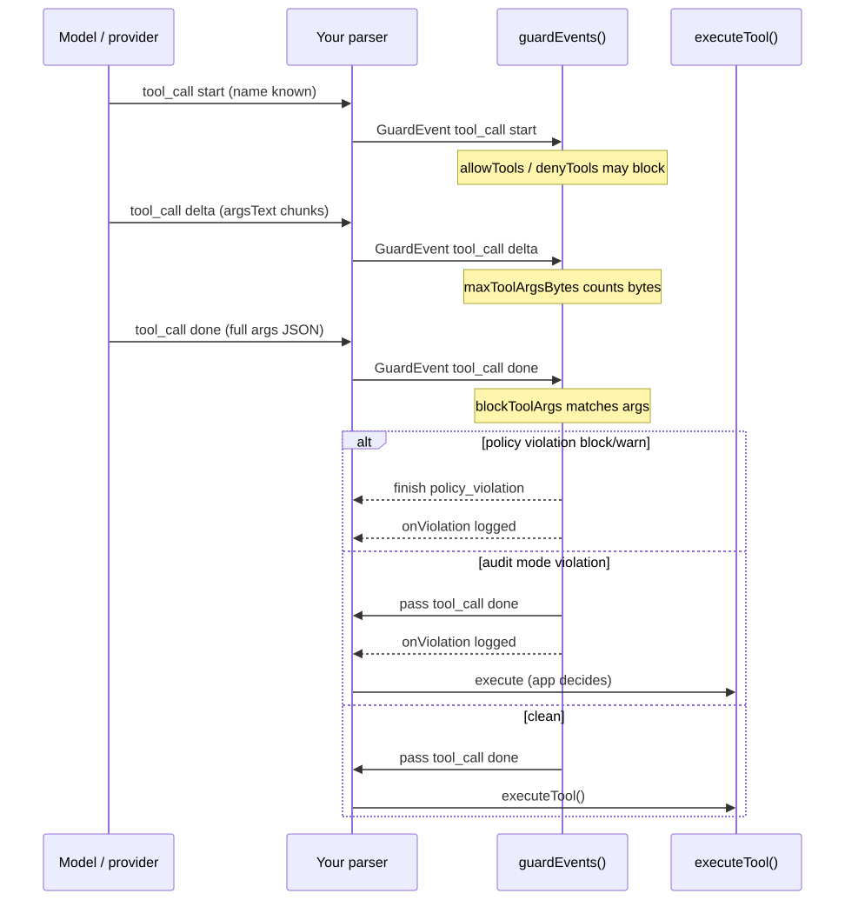

# Concepts & glossary

**Audience:** Beginners learning LLM streaming terminology and how **llm-stream-guard** fits in.  
**See also:** [Getting started](./getting-started.md) · [Documentation map](./docs-map.md)

---

## LLM streaming basics

### Stream

A **stream** is a long HTTP response delivered in many small pieces instead of one JSON object. Chat UIs render text as each piece arrives (“typing” effect).

### SSE (Server-Sent Events)

A common wire format for LLM APIs. Lines look like:

```text
data: {"type":"text","text":"Hello"}
data: {"type":"text","text":" world"}

```

The client reads line-by-line. Proxies often forward this **opaque byte stream** without parsing JSON.



### Token / delta

A **delta** is one incremental piece of model output — often a few characters or a JSON fragment. Guard rules on `text` / `reasoning` usually run on **delta** and **done** phases.

### Tool call

When the model wants to run a function, the provider emits **tool_call** events:

| Phase   | Meaning                  | Guard relevance                            |
| ------- | ------------------------ | ------------------------------------------ |
| `start` | Tool name known          | `allowTools` / `denyTools` can block early |
| `delta` | Partial args JSON string | `maxToolArgsBytes` counts bytes            |
| `done`  | Complete args object     | `blockToolArgs` matches full JSON          |



---

## Guard-specific terms

### GuardEvent

Our **independent event union** — not OpenAI types, not AI SDK types. Your mapper converts provider events → `GuardEvent`, then `guardEvents()` runs policy.

| Type        | Fields (simplified)                           |
| ----------- | --------------------------------------------- |
| `text`      | `phase`, `text`                               |
| `tool_call` | `phase`, `id?`, `name?`, `args?`, `argsText?` |
| `reasoning` | `phase`, `text`                               |
| `error`     | `message`, `code?`                            |
| `finish`    | `reason?`                                     |



Full spec: [proposal.MD § GuardEvent model](./proposal.MD#guardevent-model-independent).

### GuardTransform

A single rule function in the event pipeline — e.g. output of `redactSecrets()` or `allowTools(["search"])`. Order matters; see [Cookbook §5](./integration-cookbook.md#5-transform-ordering).

### GuardContext

**Stateful object per stream** — holds byte lookback buffer, per-tool arg byte counts, accumulated violations. **Never share** across concurrent HTTP requests.



### Violation

Record emitted when a rule matches: `{ rule, message, mode }`. Delivered via `onViolation` and/or `ctx.violations`. Does not always stop the stream — depends on mode and rule.

### Violation modes: block, warn, audit

| Mode      | User-visible effect                  | Logging                |
| --------- | ------------------------------------ | ---------------------- |
| **block** | Tool blocked; safe substitute events | `onViolation`          |
| **warn**  | Same as block for tools              | `onViolation`          |
| **audit** | Tools pass through                   | `onViolation` (shadow) |

Secrets are **always redacted** in byte and event modes regardless of mode label.



---

## Choosing byte vs event mode

```text
Raw response.body → browser?
  YES → createByteGuard()

Parsed tool_call JSON before executeTool()?
  YES → guardEvents() + allowTools / blockToolArgs

Only have logs / files offline?
  → CLI scan (no streaming API)
```

Decision diagram: [modes.svg](./img/modes.svg)

---

## Byte mode and chunk redaction

TCP may split `sk-secret123` as `sk-se` | `cret123`. A naive regex on each chunk fails.

Byte guard keeps a **rolling lookback buffer** (~128 B) and **holds back** incomplete secret prefixes until confirmed or flushed on stream close.


---

## Policy layer

### Policy document

JSON or YAML file (`version: "1"`) listing **rules** and optional `mode`, `policyVersion`, `extends`.

### Rule keys

Each rule entry has exactly **one** key — see [Policy reference § Rule types](./policy-reference.md#rule-types).


### Profiles

Shipped examples under `policies/` and `src/policy/profiles/`:

| Profile        | Purpose                                  |
| -------------- | ---------------------------------------- |
| `proxy-strict` | Byte-oriented redaction + error sanitize |
| `agent-gate`   | Tool allowlist for agents                |
| `audit-only`   | Log violations, minimal blocking         |

### Validation codes POLICY_E001–E011

Stable error codes from `validatePolicy()`. E.g. E009 = overlapping allow/deny lists. Full table: [Policy reference § Error codes](./policy-reference.md#error-codes).

---

## Static audit (offline)

Separate from live `guardEvents()`:

| Term          | Meaning                                                                             |
| ------------- | ----------------------------------------------------------------------------------- |
| **Manifest**  | File listing tools (`tools/manifest.json`, MCP export, OpenAPI `x-tools`)           |
| **Drift**     | Tool name in manifest but not allowed by policy (or reverse)                        |
| **D001–D006** | Built-in dangerous string patterns in manifest text fields                          |
| **SARIF**     | Static analysis interchange format — preview export from `audit static --sarif-out` |


---

## Ecosystem (optional)

| Package                 | Question it answers                              |
| ----------------------- | ------------------------------------------------ |
| **llm-stream-guard**    | What may go downstream?                          |
| **llm-stream-assemble** | What did the provider send? (parse SSE → events) |

No npm dependency between them — compose in application code only.



---

## CLI vs programmatic API

| Use CLI when…                    | Use API when…                                   |
| -------------------------------- | ----------------------------------------------- |
| CI scans captured fixtures       | Live proxy/agent integration                    |
| Validate policy in PR            | `createGuardFromPolicy()` in app                |
| `audit static` on repo manifests | `runStaticScan()` from `llm-stream-guard/audit` |
| Quick one-off log check          | Custom `onViolation` routing                    |

CLI reference: [cli-reference.md](./cli-reference.md)

---

## Glossary index

| Term                 | Section                                                                        |
| -------------------- | ------------------------------------------------------------------------------ |
| SSE                  | [LLM streaming basics](#sse-server-sent-events)                                |
| GuardEvent           | [Guard-specific terms](#guardevent)                                            |
| block / warn / audit | [Violation modes](#violation-modes-block-warn-audit)                           |
| TransformStream      | [Getting started § Byte mode](./getting-started.md#byte-mode-your-first-guard) |
| Drift                | [Static audit](#static-audit-offline)                                          |
| SARIF                | [Static audit](#static-audit-offline)                                          |
| `policyVersion`      | [Policy layer](#policy-document)                                               |
