# Getting started

**Audience:** Developers new to LLM streaming **or** new to this package.  
**Time:** ~15 minutes to a working guard.  
**Version:** 0.8.2+ (stable)

> **Not sure where to go next?** See the [documentation map](./docs-map.md) for learning paths by role.

---

## What problem does this solve?

Large language models (LLMs) often stream their answer back as **many small chunks** over HTTP — not as one JSON blob. While that stream flows through your proxy, agent, or chat UI, unsafe content can leak:

1. **Secrets** — `sk-…`, `ghp_…`, JWTs echoed in model text.
2. **Dangerous tool arguments** — `rm -rf`, shell pipes, huge JSON payloads.
3. **Wrong tool names** — model calls `bash` when you only allow `search`.
4. **Raw provider errors** — internal URLs and stack traces sent to the browser.

**llm-stream-guard** sits **in the middle of the stream** and redacts or blocks before your user or tool executor sees the data. Zero runtime npm dependencies.

---

## What you need

| Requirement                  | Notes                                              |
| ---------------------------- | -------------------------------------------------- |
| **Node.js 18+**              | Web Streams API (`TransformStream`, `pipeThrough`) |
| **TypeScript or JavaScript** | Types ship in the package                          |
| **A stream to protect**      | Provider SSE, parsed events, or captured log files |

Install:

```bash
pnpm add llm-stream-guard
# or: npm install llm-stream-guard
```

---

## Two ways to use the library

| Mode      | API                 | You have…                   | Typical app              |
| --------- | ------------------- | --------------------------- | ------------------------ |
| **Byte**  | `createByteGuard()` | Raw bytes / SSE, no parser  | HTTP proxy, gateway      |
| **Event** | `guardEvents()`     | Parsed `GuardEvent` objects | Agent loop, chat backend |



**Rule of thumb:** If you forward `response.body` unchanged → **byte mode**. If you parse tool JSON before executing → **event mode**.

Full decision tree: [Concepts § Choosing a mode](./concepts-and-glossary.md#choosing-byte-vs-event-mode).

---

## Byte mode: your first guard

Use when you proxy provider SSE and want secrets stripped **even when split across TCP chunks**.

```ts
import { createByteGuard } from "llm-stream-guard";

// upstream: fetch() to OpenAI, Anthropic, etc.
const guarded = upstream.body!.pipeThrough(
	createByteGuard({
		redactSecrets: true,
		sanitizeErrors: true,
		mode: "warn",
		onViolation: (v) => console.warn(v.rule, v.message),
	}),
);

return new Response(guarded, { headers: { "Content-Type": "text/event-stream" } });
```

What happens:

- Matching secret patterns become `[REDACTED]` in the outbound bytes.
- Provider `error` events in the byte stream can be sanitized (when enabled).
- `onViolation` fires for audit logging; bytes are still redacted in all modes.

See [chunk redaction diagram](./img/chunk-redaction.svg) for why a rolling buffer matters.

**Next:** [Cookbook §2 — Hono / Express / Workers proxies](./integration-cookbook.md#2-byte-mode-proxies)

---

## Event mode: tool gate

Use when you have **structured events** — especially `tool_call` with a name and JSON args — and want to block **before** `executeTool()`.

```ts
import { allowTools, blockToolArgs, guardEvents, redactSecrets } from "llm-stream-guard";

const allowed = ["search", "read_file"];

for await (const event of guardEvents(
	parsedEvents, // AsyncIterable<GuardEvent>
	{ mode: "block", onViolation: (v) => logViolation(v) },
	redactSecrets(),
	allowTools(allowed),
	blockToolArgs(/rm\s+-rf/),
)) {
	if (event.type === "tool_call" && event.phase === "done") {
		await executeTool(event); // only reaches here if policy passed
	}
}
```

What happens:

- `allowTools` — any other tool name → `policy_violation` (behavior depends on `mode`).
- `blockToolArgs` — regex / substring / function match on parsed args at `done`.
- `redactSecrets` — still runs on `text` / `reasoning` deltas.



**Next:** [Cookbook §3 — full agent loop](./integration-cookbook.md#3-event-mode-tool-gate)

---

## Which mode do I need?

Answer three questions:

1. **Do you parse the stream into events today?**
   - No → start with **byte mode**.
   - Yes → use **event mode** (map your events to `GuardEvent` first).

2. **Do you execute tools from the model?**
   - Yes → you need **event mode** (`allowTools`, `blockToolArgs`, `maxToolArgsBytes`). Byte mode cannot see tool JSON reliably.

3. **Do you only need offline checks (CI, logs)?**
   - Use the **CLI** — no streaming code required:  
     `npx llm-stream-guard scan --policy policies/agent-gate.json captures/`

---

## Policy files (recommended for teams)

Instead of wiring rule factories in code, use a JSON/YAML **policy file** — same rules, plus version tracking and CLI scan.

```json
{
	"version": "1",
	"policyVersion": "team-v1",
	"mode": "block",
	"rules": [
		{ "allowTools": { "names": ["search", "read_file"] } },
		{ "blockToolArgs": { "contains": "rm -rf" } },
		{ "redactSecrets": {} }
	]
}
```

```ts
import { createGuardFromPolicy, loadPolicy } from "llm-stream-guard";

const guard = createGuardFromPolicy(loadPolicy("./policies/agent-gate.json"));
for await (const e of guard.guard(events)) {
	/* … */
}
```

Built-in profiles: `proxy-strict`, `agent-gate`, `audit-only` (see [Policy reference](./policy-reference.md)).


---

## Violation modes: block, warn, audit

| Mode    | Secrets / PII | Tool policy                                 | Typical use                |
| ------- | ------------- | ------------------------------------------- | -------------------------- |
| `block` | Redact        | Block tool + emit `policy_violation` finish | Production agent gates     |
| `warn`  | Redact        | Block tool + `onViolation`                  | Staging / gradual rollout  |
| `audit` | Redact + log  | Pass tool through + `onViolation`           | Shadow mode, SIEM sampling |


Details: [Concepts § Violation modes](./concepts-and-glossary.md#violation-modes-block-warn-audit).

---

## Static audit (before deploy)

Runtime guard protects **live streams**. **Static audit** checks **tool manifest files** (MCP exports, OpenAPI `x-tools`, YAML lists) for:

- Allowlist **drift** (tool in manifest but not in policy),
- **Dangerous strings** (D001–D006 catalog),
- **`blockToolArgs` preview** on manifest text fields.

```bash
npx llm-stream-guard audit static \
  --policy policies/agent-gate.json \
  --root . \
  --manifest tools/manifest.json
```

See [Static scanning](./static-scanning.md) and [static audit flow diagram](./img/static-audit-flow.svg).

---

## Common mistakes (beginners)

| Mistake                                               | Fix                                                                                   |
| ----------------------------------------------------- | ------------------------------------------------------------------------------------- |
| Sharing one `GuardContext` across concurrent requests | Create **one context per stream** ([lifecycle diagram](./img/scaffold-lifecycle.svg)) |
| Using byte mode to block tool names                   | Switch to **event mode** + `allowTools`                                               |
| Expecting redaction on `finish` / `error` events      | By design, those event types are not redacted ([FAQ](./faq.md))                       |
| Empty `allowTools` list with `mode: block`            | Validation error `POLICY_E010` — see [Policy reference](./policy-reference.md)        |
| Parsing SSE manually in byte mode                     | Not required — byte guard scans raw bytes including `data:` lines                     |

---

## Next steps

| Step                                  | Resource                                          |
| ------------------------------------- | ------------------------------------------------- |
| Learn vocabulary (SSE, GuardEvent, …) | [Concepts & glossary](./concepts-and-glossary.md) |
| Copy-paste integrations               | [Integration cookbook](./integration-cookbook.md) |
| Policy rules & error codes            | [Policy reference](./policy-reference.md)         |
| All CLI flags                         | [CLI reference](./cli-reference.md)               |
| CI / GitHub Action                    | [CI guide](./ci-github-action.md)                 |
| Architecture deep dive                | [proposal.MD](./proposal.MD)                      |

---

## Minimal local smoke (from git clone)

```bash
git clone git@github.com:01laky/llm-stream-guard.git
cd llm-stream-guard
pnpm install
pnpm verify
node examples/minimal-node/smoke.mjs
```

This runs a tiny programmatic guard without wiring a real LLM provider.
