# Policy reference

**Audience:** Teams authoring JSON/YAML guard policies.  
**Schema:** [`schemas/policy-v1.json`](../schemas/policy-v1.json)  
**Examples:** [`policies/`](../policies/) · [`test/fixtures/policies/`](../test/fixtures/policies/)

---

## Document shape

```json
{
	"version": "1",
	"policyVersion": "optional-team-label",
	"mode": "block",
	"extends": "./parent.json",
	"byte": { "redactSecrets": true, "sanitizeErrors": true },
	"rules": [{ "allowTools": { "names": ["search"] } }]
}
```

| Field           | Required | Description                                                      |
| --------------- | -------- | ---------------------------------------------------------------- |
| `version`       | Yes      | Must be `"1"`                                                    |
| `policyVersion` | No       | Opaque string echoed in scan reports / violations                |
| `mode`          | No       | Default `warn`; overridden by `GUARD_MODE` or CLI `--mode`       |
| `extends`       | No       | Merge parent policy (see [Inheritance](#inheritance-extends))    |
| `byte`          | No       | Flags for `createByteGuard()` when using `createGuardFromPolicy` |
| `rules`         | Yes      | Array of rule objects (one key each)                             |

Validate locally:

```bash
npx llm-stream-guard validate policies/agent-gate.json
npx llm-stream-guard resolve policies/examples/extends-agent.json --json
```



---

## Rule types

Each `rules[]` entry must contain **exactly one** of the keys below.



### `redactSecrets`

Redact built-in secret patterns in `text` and `reasoning` events (and byte mode when enabled).

```json
{ "redactSecrets": {} }
```

Optional byte-only twin lives under top-level `byte.redactSecrets`.

### `redactPII`

Opt-in email / phone redaction. **At least one flag must be true.**

```json
{ "redactPII": { "email": true, "phone": false } }
```

Invalid `{}` → `POLICY_E004`.

### `allowTools`

Allow only listed tool names. Empty list denies **all** tools in block mode.

```json
{ "allowTools": { "names": ["search", "read_file", "grep"] } }
```

Runtime: `allowTools(["search", "read_file"])`.

### `denyTools`

Block listed tool names regardless of allowlist.

```json
{ "denyTools": { "names": ["bash", "shell"] } }
```

Do not overlap names with `allowTools` in the same effective policy → `POLICY_E009`.

### `blockToolArgs`

Match dangerous substrings in tool args at `tool_call.done`.

```json
{ "blockToolArgs": { "pattern": "rm\\s+-rf" } }
```

or

```json
{ "blockToolArgs": { "contains": "DROP TABLE" } }
```

Exactly **one** of `pattern` (RegExp string) or `contains` (plain string). Invalid regex → `POLICY_E003`. Neither/both → `POLICY_E007`.

Programmatic API also accepts `RegExp`, string, or function matchers — see [Getting started § Event mode](./getting-started.md#event-mode-tool-gate).

### `maxToolArgsBytes`

Reject tool calls whose accumulated args exceed byte limit.

```json
{ "maxToolArgsBytes": { "max": 65536 } }
```

### `sanitizeErrors`

Replace provider error messages with generic text.

```json
{ "sanitizeErrors": {} }
```

Byte twin: `byte.sanitizeErrors`.

---

## Inheritance (`extends`)

Child policy merges over parent:

- Duplicate rule **keys** in `rules[]` → child replaces parent entry for that key type.
- `byte` section merges field-by-field.
- Relative paths resolve from child file directory.
- Max depth capped — cycles → `POLICY_E006`, missing parent → `POLICY_E005`.

```bash
npx llm-stream-guard diff policies/v1.json policies/v2.json
npx llm-stream-guard diff policies/a.json policies/b.json --check  # exit 1 if changed
```

---

## Mode precedence

Effective mode for scan / compiled guard:

1. `GUARD_MODE` environment variable (if valid)
2. CLI `--mode` / `LoadPolicyOptions.mode`
3. Policy file `mode`
4. Default `warn`

---

## Error codes

| Code            | When                                                      |
| --------------- | --------------------------------------------------------- |
| **POLICY_E001** | Invalid root, bad/missing `version`                       |
| **POLICY_E002** | Invalid `mode`, malformed `rules`, unknown keys           |
| **POLICY_E003** | Invalid `blockToolArgs.pattern` regex                     |
| **POLICY_E004** | `redactPII` without `email` or `phone` true               |
| **POLICY_E005** | `extends` target file not found                           |
| **POLICY_E006** | `extends` cycle or depth exceeded                         |
| **POLICY_E007** | `blockToolArgs` missing or duplicate matcher fields       |
| **POLICY_E008** | Invalid `allowTools`/`denyTools` names array              |
| **POLICY_E009** | Same tool in allow and deny lists                         |
| **POLICY_E010** | Empty allowlist with effective `mode: block`              |
| **POLICY_E011** | Reserved export constant (not emitted by validator today) |

Human output example:

```text
POLICY_E009 rules[1] Tool "bash" appears in both allowTools and denyTools
```

---

## Built-in profiles

| ID             | File                         | Intent                            |
| -------------- | ---------------------------- | --------------------------------- |
| `proxy-strict` | `policies/proxy-strict.json` | Secrets + errors on byte streams  |
| `agent-gate`   | `policies/agent-gate.json`   | Allowlist + arg limits for agents |
| `audit-only`   | `policies/audit-only.json`   | Shadow logging, minimal blocks    |

List via CLI:

```bash
npx llm-stream-guard profiles list
npx llm-stream-guard profiles show agent-gate
```

---

## Programmatic API

```ts
import { compilePolicy, createGuardFromPolicy, loadPolicy, validatePolicy } from "llm-stream-guard";

const result = validatePolicy(doc);
if (!result.ok) console.error(result.errors);

const loaded = loadPolicy("./policies/agent-gate.json");
const guard = createGuardFromPolicy(loaded);

// Event stream
for await (const e of guard.guard(events)) {
	/* … */
}

// Byte stream
const byteGuard = guard.createByteGuard();
```

Subpath for static audit only:

```ts
import { runStaticScan } from "llm-stream-guard/audit";
```

---

## YAML policies

Minimal YAML subset supported (no anchors). Extension `.yaml` / `.yml`:

```yaml
version: "1"
mode: block
rules:
  - allowTools:
      names:
        - search
        - read_file
```

---

## Related docs

- [CLI reference](./cli-reference.md) — `validate`, `scan`, `audit static`
- [Static scanning](./static-scanning.md) — manifest drift + D001–D006
- [Integration cookbook §4](./integration-cookbook.md#4-policy-driven-setup) — wiring in apps
