# Threat model

**Status:** **1.0.0** — stable scope boundaries for the 1.x line. Not a formal STRIDE analysis; see [roadmap post-1.0](./roadmap-post-1.0.md) for future hardening ideas.

---

## Scope — what guard protects

| Layer             | Protection                                                                                     |
| ----------------- | ---------------------------------------------------------------------------------------------- |
| **Proxy wire**    | Secret redaction (+ optional error sanitization) on raw SSE bytes; **PII requires event mode** |
| **Agent runtime** | Tool allow/deny, arg patterns, size limits before execution                                    |
| **CI / repo**     | Static manifest drift, dangerous tool patterns, policy diff gates                              |



---

## Trust boundaries

```text
Provider → [byte guard OR parser → event guard] → client / tool executor
                ↑ policy file / rule factories
```

- **Caller responsibility:** map provider events to `GuardEvent` correctly.
- **One context per stream** — no shared `GuardContext` across concurrent requests ([lifecycle diagram](./img/scaffold-lifecycle.svg)).

---

## In-scope threats

- Secret leakage via streamed assistant text (including mid-chunk splits)
- Unauthorized or dangerous tool names/args reaching execution
- Policy vs codebase tool manifest drift
- Raw provider errors exposing internal URLs to browsers

---

## Out of scope

- Provider authentication, API key storage, retry logic
- Prompt injection / LLM-as-judge classification
- Tool execution sandboxing (OS-level)
- Network SSRF blocking (future rule ideas in [proposal.MD](./proposal.MD))
- Parsing provider SSE (use [llm-stream-assemble](https://github.com/01laky/llm-stream-assemble) or your parser)

Full non-goals: [proposal.MD § Non-goals](./proposal.MD#non-goals).

---

## Assumptions

- Policy files in CI are trusted (signed remote policy deferred to post-1.0).
- Operators configure `mode` intentionally (`block` vs `audit`).
- Static scan skips binary files by design.

---

## Reporting gaps

Confirmed bypasses: [security-reporting.md](./security-reporting.md) · [SECURITY.md](../SECURITY.md)

Operational issues: [troubleshooting.md](./troubleshooting.md)
