# Troubleshooting

**Status:** **1.0.0** — symptom → cause → fix for byte mode, event mode, policy, CLI, and GitHub Action.

**See also:** [FAQ](./faq.md) · [Security reporting](./security-reporting.md) · [CLI reference](./cli-reference.md) · [Policy reference](./policy-reference.md)



---

## Quick symptom index

| Symptom                               | Section                                                          |
| ------------------------------------- | ---------------------------------------------------------------- |
| Secret still visible in browser       | [§ Secret visible after guard](#secret-still-visible-in-browser) |
| `[REDACTED]` but no `onViolation`     | [§ Silent violations](#redacted-but-onviolation-never-fires)     |
| Tool executed despite deny policy     | [§ Tool ran anyway](#tool-executed-despite-deny-policy)          |
| `blockToolArgs` on delta              | [§ Tool ran anyway](#tool-executed-despite-deny-policy)          |
| `policy_violation` but args look fine | [§ Args size limit](#policy_violation-but-args-look-fine)        |
| Cross-talk between requests           | [§ Shared context](#shared-guardcontext-across-requests)         |
| `scan` skips my file                  | [§ Binary skip](#scan-skips-my-file)                             |
| `validate` POLICY_E009 / E010         | [§ Allow/deny overlap](#validate-policy_e009--e010)              |
| CLI `scan` exit 2                     | [§ Missing policy](#cli-scan-exit-2)                             |
| Action exit 3                         | [§ Action path errors](#github-action-exit-3)                    |
| Double `[REDACTED]`                   | [§ Idempotency](#double-redacted)                                |

---

## Secret still visible in browser

**Likely cause:** Byte guard runs **after** cache/CDN, or secret pattern is split across TCP chunks and lookback is too small / guard not on wire.

**Fix:**

1. Attach `createByteGuard()` on the **upstream response body** before any cache layer.
2. Confirm `redactSecrets: true` (byte flags or policy `byte.redactSecrets`).
3. See [chunk redaction diagram](./img/chunk-redaction.svg) and [Getting started § Byte mode](./getting-started.md#byte-mode-your-first-guard).

```ts
upstream.body!.pipeThrough(
	createByteGuard({ redactSecrets: true, sanitizeErrors: true, mode: "warn" }),
);
```

---

## `[REDACTED]` but `onViolation` never fires

**Likely cause:** `mode: "block"` without `onViolation` callback; or you expect violations on redaction-only paths.

**Fix:** Pass `onViolation` in `guardEvents` / byte options. Use `audit` mode to pass events through while logging. See [violation modes](./concepts-and-glossary.md#violation-modes-block-warn-audit).

```ts
guardEvents(
	source,
	{
		mode: "audit",
		onViolation: (v) => logger.info(v),
	},
	redactSecrets(),
);
```

---

## Tool executed despite deny policy

**Likely cause:** Event mode not applied on `tool_call.done`; `blockToolArgs` matching partial **delta** argsText; or agent calls `executeTool` before guard finishes.

**Fix:** Guard **before** execute — see [agent gate loop](./img/agent-gate-loop.svg) and [Cookbook §3](./integration-cookbook.md#3-event-mode-tool-gate).

```ts
for await (const event of guardEvents(parsed, opts, allowTools(["search"]))) {
	if (event.type === "tool_call" && event.phase === "done") {
		await executeTool(event); // only after guard emitted done
	}
}
```

---

## `policy_violation` but args look fine

**Likely cause:** `maxToolArgsBytes` counts **accumulated** `argsText` across deltas, not final JSON pretty-print size.

**Fix:** Inspect total bytes on `tool_call.done`; tune `max` in policy. See [Policy reference § maxToolArgsBytes](./policy-reference.md).

---

## Shared `GuardContext` across requests

**Likely cause:** One context reused for concurrent streams (lookback / tool state leaks).

**Fix:** **One `GuardContext` per stream/request.** See [scaffold lifecycle](./img/scaffold-lifecycle.svg).

---

## `scan` skips my file

**Likely cause:** Binary detection — NUL byte in first 512 B skips file (by design).

**Fix:** Expected for non-text captures. Use event JSON without NUL prefixes, or force text path. See [CLI reference § scan](./cli-reference.md#scan).

---

## `validate` POLICY_E009 / E010

**Likely cause:** Same tool in both `allowTools` and `denyTools`; or empty allowlist with blocking semantics.

**Fix:** See [Policy reference error codes](./policy-reference.md#validation-error-codes).

---

## CLI `scan` exit 2

**Likely cause:** Missing `--policy` or bad path.

**Fix:** Set `GUARD_POLICY_PATH` or pass `--policy policies/agent-gate.json`.

```bash
export GUARD_POLICY_PATH=policies/agent-gate.json
npx llm-stream-guard scan test/fixtures/events/clean-tool.json
```

---

## GitHub Action exit 3

**Likely cause:** Internal CLI failure — invalid resolved path, missing `dist/cli.js` in fork without build, or corrupt policy path relative to repo root.

**Fix:** Run `pnpm build` before Action in same job; verify `policy` / `static-root` paths exist from repository root. See [CI guide](./ci-github-action.md).

---

## Double `[REDACTED]`

**Likely cause:** Idempotency regression or double-pass through two redact transforms.

**Fix:** Upgrade to latest patch; avoid stacking two `redactSecrets()` transforms. File issue with minimal fixture under `test/fixtures/`.

---

## Debug checklist

1. **Effective mode:** `echo $GUARD_MODE` or `npx llm-stream-guard resolve policies/agent-gate.json --json`
2. **Policy valid:** `npx llm-stream-guard validate policies/agent-gate.json`
3. **Scan report:** `npx llm-stream-guard scan --policy … --json path`
4. **Static audit:** `npx llm-stream-guard audit static --policy … --root . --json`

---

## Where to get help

- [FAQ](./faq.md) — common product questions
- [Upgrade guide](./upgrade-guide.md) — semver jumps
- [Security reporting](./security-reporting.md) — confirmed bypasses (not typos)
- [GitHub issues](https://github.com/01laky/llm-stream-guard/issues) — bugs and docs fixes
